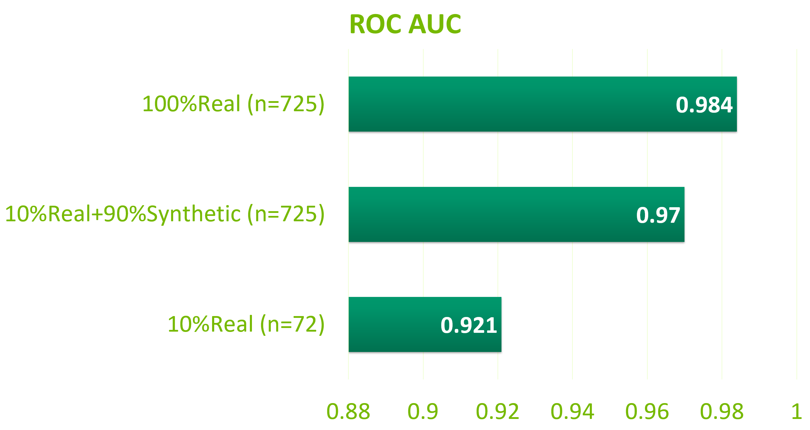
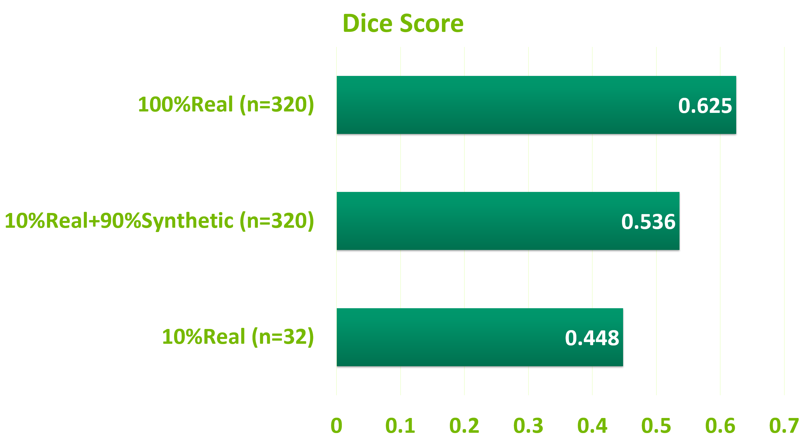

# RadImageGAN
[StyleGAN-XL](https://github.com/autonomousvision/stylegan-xl) was applied to [RadImageNet](https://github.com/BMEII-AI/RadImageNet) to develop a radiologic data generator, RadImageGAN, which can generate a large quantity of synthetic images with labels that fall within the pathologic classes of RadImageNet. [BigDatasetGAN](https://github.com/nv-tlabs/bigdatasetgan_code) was subsequently applied to RadImageGAN to generate synthetic images with paired masks for segmentation. 

The parameters for the development of RadImageGAN include: 5000kimg,  7 stem layers, 4 head layers. Model was trained with 768 DGX-A100 hours. The 64x64 RadImageGAN generator can be requested through the following link: https://drive.google.com/file/d/1f3jxfSasNMFsCzlZ0Y0J3XX51TrA-Nvu/view?usp=sharing

# RadImageGAN 2023 GTC talk
Join us at 2023 GTC on March 23 to learn about RadImageGAN, a new generative AI for radiology capable of generating 165 classes with various pathologies over 14 anatomical regions from CT/MR/ultrasound. 

[Sean Huver](https://scholar.google.com/citations?user=kl4jZpAAAAAJ&hl=en&oi=ao), [Xueyan Mei](https://scholar.google.com/citations?user=u3MBcfcAAAAJ&hl=en&oi=ao), [Timothy Deyer](https://scholar.google.com/citations?user=w_Q3Du4AAAAJ&hl=en&oi=ao), [Zelong Liu](https://scholar.google.com/citations?user=-70gwqgAAAAJ&hl=en&oi=ao).

GTC session link: https://www.nvidia.com/gtc/session-catalog/?search=S51264&tab.catalogallsessionstab=16566177511100015Kus&ncid=so-twit-537230-vt12#/session/1666293414192001JDgi

  

# Downstream evaluation of synthetic data generated by RadImageGAN and BigDatasetGAN:
RadImageGAN and BigDatasetGAN were assessed using two public datasets: one from [MRNet](https://stanfordmlgroup.github.io/competitions/mrnet/) containing MRI images of normal and torn anterior cruciate ligaments (ACL) (n=841), and another from the Thyroid Digital Image Database, [TDID](http://cimalab.unal.edu.co/?lang=en&mod=program&id=5) (n=437).

Three experiments were conducted to evaluate the effectiveness of synthetic data. Two baseline models were developed using the full and 10% training data, and were compared to a model that utilized 10% real data and 90% synthetic data. For ACL classification, RadImageGAN generated 293 synthetic normal knee and 360 synthetic ACL pathology images in the same distribution as the ACL tear dataset. For thyroid nodule segmentation, a senior radiologist annotated 67 RadImageGAN synthetic images to generate 288 paired BigDatasetGAN thyroid nodule images and masks.

  

# RadImageGAN examples: 

  

# BigDatasetGAN examples:

|Lung (CT) Pulmonary Opacities| Knee (MRI) ACL Pathologies | Thyroid (US) Thyroid Nodules
:---:  |  :---:  |  :---:
 | | 

# Downstream Results
|ACL Tear Classification | Thyroid Nodule Segmentation
:---:  |  :---:  
 | 

# Acknowledgement
We would like to thank all our collaborators in this work.

**Mount Sinai**: 

Dr. Zahi A. Fayad, Director of BMEII

**NVIDIA**: 

Daiqing Li, Timo Aila, PhD, Mahdi Azizian, PhD, Risto Haukioja

**University of Tübingen**: 

Axel Sauer

**ERMI Collaborators**: 

Drs. Richard Katz, Morton Scheneider, Steven Albert, Alison Haimes, Stephen Greenberg, Douglas Decorato, Gavin Duke, Paul Choi, Sean Herman,
Robert Ludwig, Gwen Harris, Adam Wilner, Mark Pinals, Nicole Lee, Clyde Hershon, Michelle Klein and Barbara Braffman 

David Vazquez 

Justin Ponquinette
