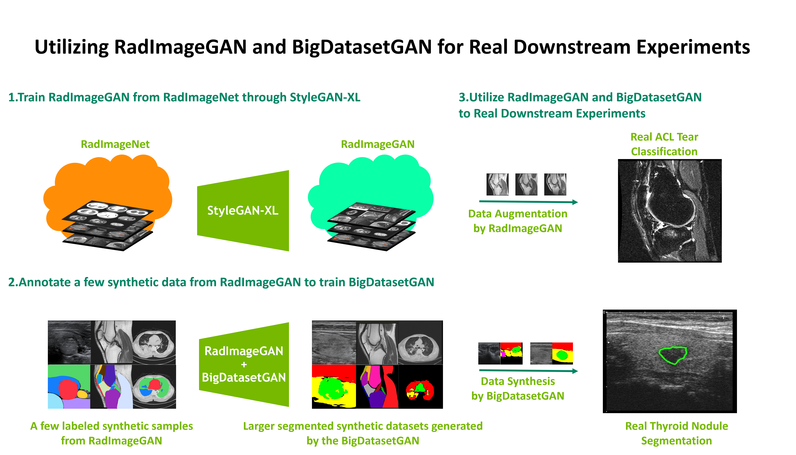

# RadImageGAN

The development of RadImageGAN is based on [RadImageNet](https://github.com/BMEII-AI/RadImageNet) and [StyleGAN-XL](https://github.com/autonomousvision/stylegan-xl). The parameters include: 5000kimg,  7 stem layers, 4 head layers. Model was trained with 768 DGX-A100 hours.

RadImageGAN example:

  <video src="media/radimagegan_video.mp4" width="60%"></video>

Downstream evaluation:

