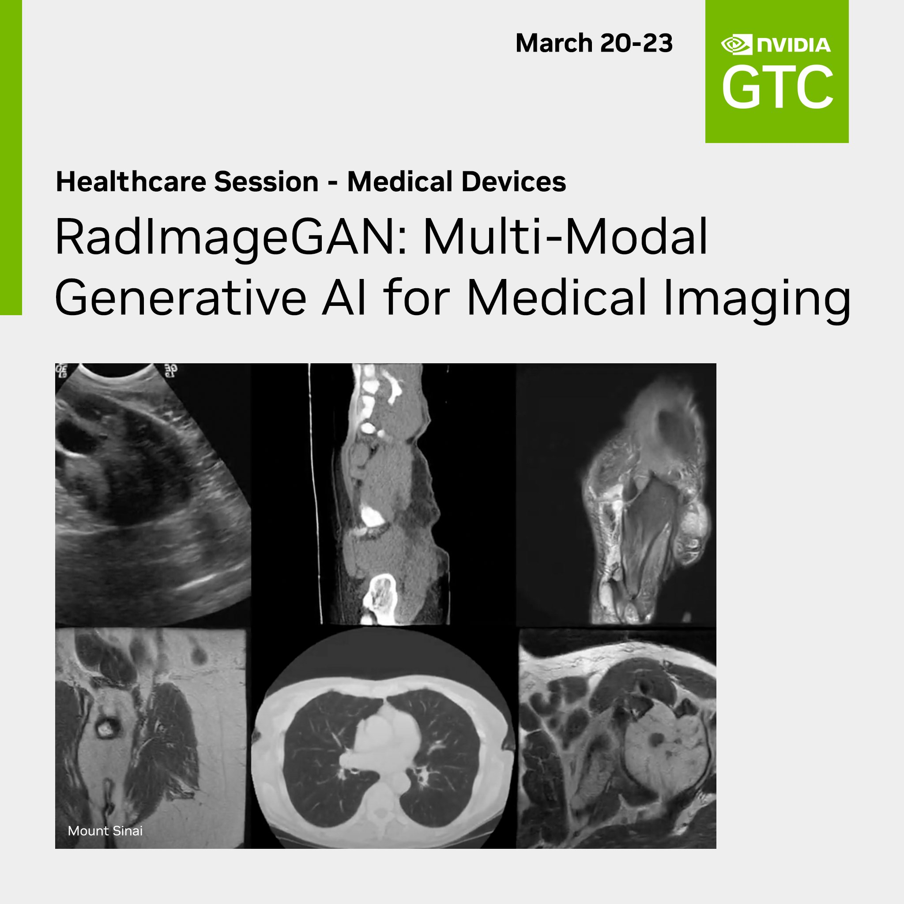
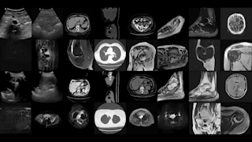

# RadImageGAN
The development of RadImageGAN is based on [RadImageNet](https://github.com/BMEII-AI/RadImageNet) and [StyleGAN-XL](https://github.com/autonomousvision/stylegan-xl). The parameters include: 5000kimg,  7 stem layers, 4 head layers. Model was trained with 768 DGX-A100 hours. The RadImageGAN generator can be requested through the following link: https://drive.google.com/file/d/1f3jxfSasNMFsCzlZ0Y0J3XX51TrA-Nvu/view?usp=sharing

# RadImageGAN 2023 GTC talk
Join us at 2023 GTC on March 23 to learn about RadImageGAN, a new generative AI for radiology capable of generating 165 classes with various pathologies over 14 anatomical regions from CT/MR/ultrasound.
https://www.nvidia.com/gtc/session-catalog/?search=S51264&tab.catalogallsessionstab=16566177511100015Kus&ncid=so-twit-537230-vt12#/session/1666293414192001JDgi

  

# RadImageGAN examples: 

  

# Downstream evaluation:

  

